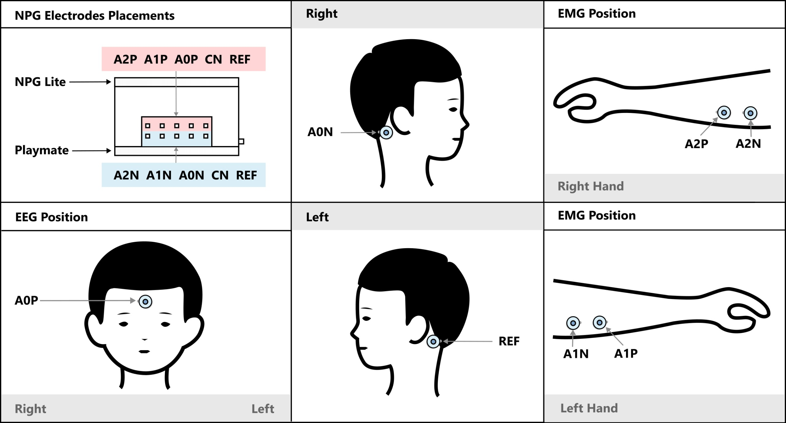

# EEG/EMG-Based Car Control Firmware

This folder contains firmware for **brain–computer / muscle–computer interaction** using the **NPG-Lite** device.  
The system enables **hands-free control of a robotic car** using **EEG (brain signals)** and **EMG (muscle activity)** over **Bluetooth Low Energy (BLE)**.

The firmware is designed for **research, demos, and educational neuroscience projects**.

---

## 1. Hardware Overview

### Recording Device (Signal Acquisition)

* **NPG-Lite (ESP32 based)**
* 3 analog input channels:
  * **CH1 (A0)** – EEG (Beta band detection)
  * **CH2 (A1)** – Left-hand EMG
  * **CH3 (A2)** – Right-hand EMG
* Sampling rate: **512 Hz**
* On-board features:
  * NeoPixel LEDs
  * BLE connectivity

### Controlled Device

* **BLE-enabled robotic car**
* Communication via **Bluetooth Low Energy (BLE)**

---

## 2. Electrode Placement

### EEG (Channel 1 – A0)

**Purpose:**
* Beta-band power estimation
* Forward motion control

**Recommended placement:**
* Active electrode (AOP): **Center forehead**
* Reference (REF): **Behind the right ear**
* Ground (GND): **Behind the left ear**

---

### EMG – Left Hand (Channel 2 – A1)

* Place electrodes over **left forearm flexor muscles**
* Controls:
  * **Left turn**
  * **Backward motion (when combined with right EMG)**

---

### EMG – Right Hand (Channel 3 – A2)

* Place electrodes over **right forearm flexor muscles**
* Controls:
  * **Right turn**
  * **Backward motion (when combined with left EMG)**

**EMG placement tips:**
* Place electrodes parallel to muscle fibers
* Ensure good skin contact for clean signals

---

## 3. Signal Processing Pipeline

### EEG Processing

* 50 Hz Notch Filter (power-line noise removal)
* Low-pass EEG smoothing filter
* FFT (512-point)
* Bandpower extraction:
  * Delta (0.5–4 Hz)
  * Theta (4–8 Hz)
  * Alpha (8–13 Hz)
  * **Beta (13–30 Hz)**
  * Gamma (30–45 Hz)
* Exponential smoothing of bandpower
* Beta power normalized against total power

---

### EMG Processing

* 50 Hz Notch Filter
* High-pass filter (70 Hz)
* Rectification
* Envelope detection (moving average)

---

## 4. User Controls & Interactions

### 4.1 Forward Movement (EEG – Beta Power)

* When **Beta band power > threshold (default: 4%)**:
  * Car moves **forward**
  * BLE value sent: **`3`**

* When beta power falls below threshold:
  * Car stops
  * BLE value sent: **`0`**

---

### 4.2 EMG-Based Turning

#### Left Hand EMG (Channel A1)

* Envelope > threshold:
  * Car turns **left**
  * BLE value sent: **`2`**

#### Right Hand EMG (Channel A2)

* Envelope > threshold:
  * Car turns **right**
  * BLE value sent: **`1`**

---

### 4.3 Backward Motion (Dual EMG Activation)

* **Both EMG channels active simultaneously**:
  * Car moves **backward**
  * BLE value sent: **`4`**
  * EEG forward command is temporarily disabled

---

## 5. BLE Control Protocol

### BLE Service

* Custom BLE service UUID
* Two characteristics:

| Characteristic | Purpose                 |
|---------------|-------------------------|
| Char 1        | Motion control commands |
| Char 2        | Reserved / extensible   |

### Control Values

| Value | Action     |
|------:|------------|
| 0     | Stop       |
| 1     | Right turn |
| 2     | Left turn  |
| 3     | Forward    |
| 4     | Backward   |

---

## 6. LED Indicators

| LED Color | Meaning            |
|----------|--------------------|
| Yellow   | Device running     |
| Green   | BLE connected      |
| Red     | BLE disconnected   |

---

## 7. Intended Use & Disclaimer

⚠️ **This firmware is intended for research, education, and controlled demonstrations only.**

* Use the car in open, safe environments
* Avoid operation near people or fragile objects
* Signal thresholds may require tuning per user

---

> Making neuroscience affordable and accessible for everyone 🧠⚡  
> — **Upside Down Labs**
