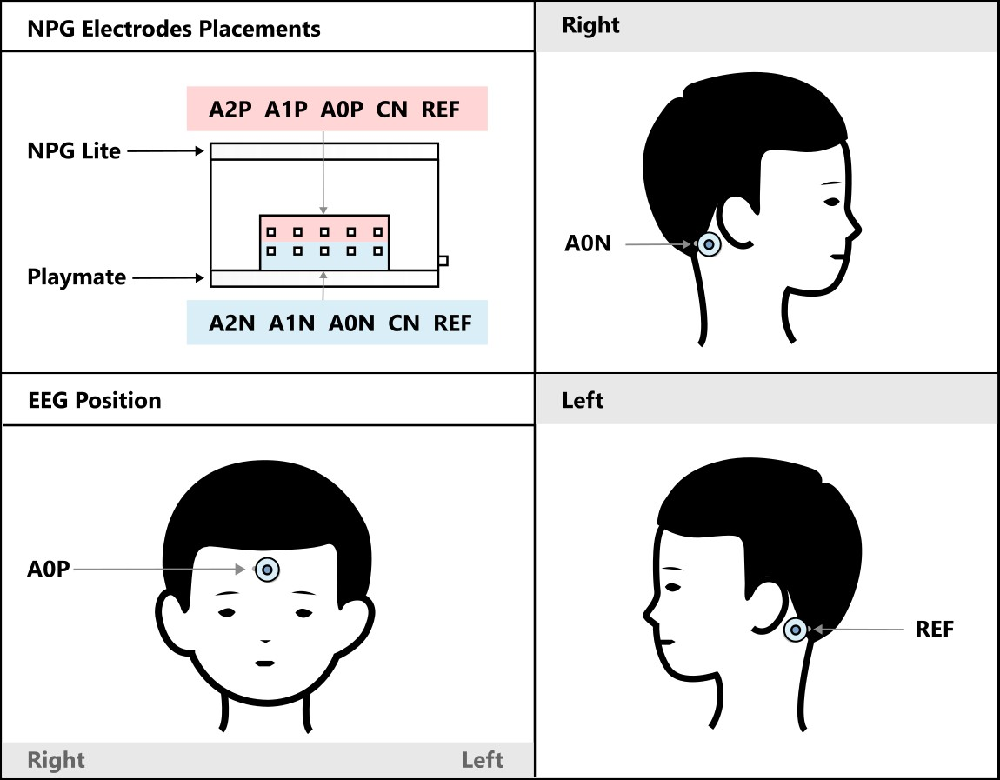
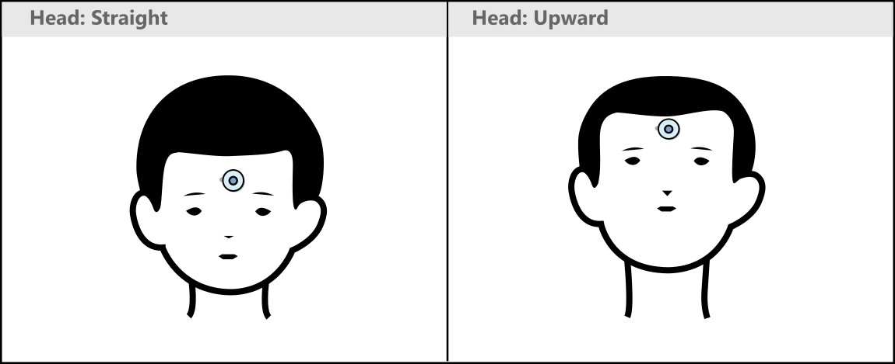
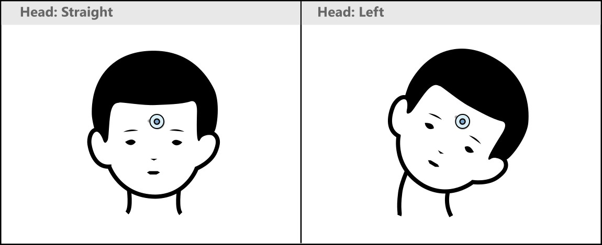

# NPG-Mouse: Neuro Playground Lite Mouse Control

This project turns the Neuro Playground Lite (NPG) into a hands-free mouse controller using a headband. It combines EEG/Jaw clench/EOG blink detection and head movement sensing for intuitive computer control.

## **[How to Use](#how-to-use)**

## What It Does
- **Head Movement → Mouse Movement:**
  - The BMI270 sensor (gyro + accelerometer) is attached to the headband and connected to NPG via the Qwiic port.
  - Moving your head up/down or left/right moves the cursor by a fixed amount. Cursor displacement is directly proportional to how much you move your head, and stops when your head stops (unlike joystick mode where the cursor moves continuously based on tilt angle).
  - This project uses only gyroscope of the sensor.
- **Blink Detection & jaw clench → Mouse Clicks:**
  - NPG reads single-channel EOG data.
  - Jaw clench triggers a left mouse click.
  - Double blinks trigger a left mouse hold, and again double blinking releases the hold.
  - Triple blinks trigger a right mouse click.

## How It Works
- **Sensors Used:**
  - **BMI270:** Detects head tilt and orientation for cursor movement.
  - **EEG/Jaw clench/EOG Input:** Detects blinks for mouse clicks.
- **Mouse Control:**
  - The code processes head tilt angles and translates them into smooth mouse movements.
  - Sensitivity, deadzone, and acceleration are adjustable for comfort and precision.
- **Blink Detection:**
  - The EOG signal is filtered and analyzed to detect blinks.
- **Calibration:**
  - The headband calibrates itself for neutral position and movement directions using vibration feedback.
- **BLE Connection:**
  - NPG acts as a Bluetooth mouse and keyboard, allowing wireless control.

## How To Use
1. Attach the NPG and BMI270 to a headband.
2. Connect the BMI270 to the NPG via the Qwiic port.
3. Install the `BleCombo.h` library following the [Library Installation](#library-installation) section.
4. Compile and upload the sketch to your NPG Lite board.
5. Set up your electrodes and calibrate the sensor as described in the [Connection and Calibration](#connection-and-calibration) section below.
6. Move your head to control the mouse cursor.
7. Jaw clench for a left click, double blink to toggle/release left hold, and triple blink for a right click.

## Connection and Calibration
1. Clean your forehead and the bony area behind your ears with alcohol swabs.
2. Attach the snap cables to the gel electrodes, then peel and stick the electrodes onto the cleaned areas as shown below.

3. Turn on the NPG, open Bluetooth on your device, and connect to `NPG Lite BCI Mouse`. You'll feel a short vibration confirming the connection.

4. **Calibration begins automatically.** Follow the vibration cues:

   - **First vibration (~3 seconds):** Look up or tilt your head upward and hold the position until the vibration stops, then return to neutral.

   

   - **Second vibration (~3 seconds):** Tilt your head to the left and hold until the vibration stops, then return to neutral.

   

5. After a brief pause, you'll feel one final short vibration, which means calibration is complete and the mouse is now active.

## Library Installation

> For a full visual guide covering both the ZIP method and Library Manager method, refer to:
> **[Installing Arduino Library](https://docs.upsidedownlabs.tech/guides/usage-guides/arduino-library-from-github/index.html)**

The sketch uses the `BleCombo.h` library from [ESP32-BLE-Combo](https://github.com/upsidedownlabs/ESP32-BLE-Combo), which is not included with Arduino IDE by default. Follow the steps below to install it:

1. Open the [ESP32-BLE-Combo](https://github.com/upsidedownlabs/ESP32-BLE-Combo) GitHub repository.
2. Click the green `<> Code` button. In the dropdown, click `Download ZIP`.
3. Open Arduino IDE. Click on **`Sketch` → `Include Library` → `Add .ZIP Library...`**.
4. Select the downloaded ZIP file and install it.
5. In case of any issue, refer to the library installation guide provided above.

---

**Made by Upside Down Labs.**

Open-source, affordable neuroscience for everyone!
