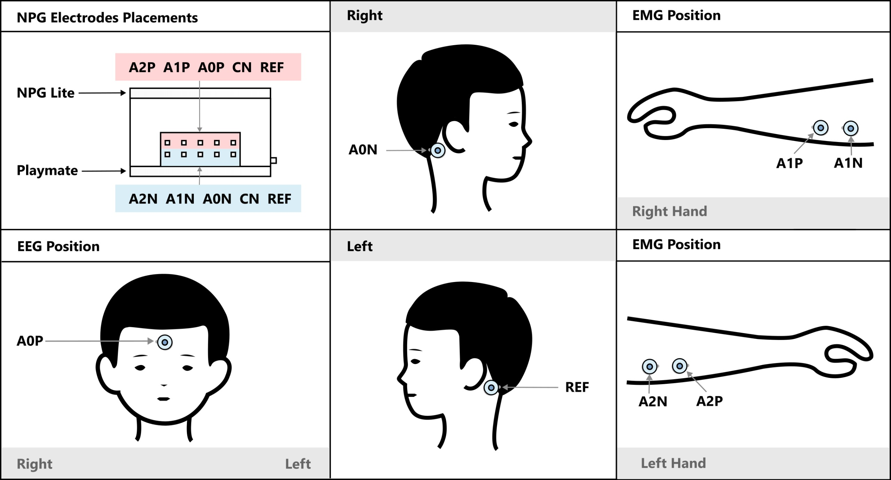

# EEG/EMG-Based Drone Control Firmware

This folder contains firmware for **brain–computer / muscle–computer interaction** using the **NPG‑Lite** device. The system enables hands‑free control of a **DJI Tello drone** using EEG (brain signals), EMG (muscle activity), eye blinks, and jaw clenches.

The firmware is designed for **research, demos, and educational neuroscience projects**.

---

## 1. Hardware Overview

### Recording Device (Signal Acquisition)

* **NPG‑Lite (ESP32 based)** 
* 3 analog input channels:

  * **CH1 (A0)** – EEG + jaw clench detection
  * **CH2 (A1)** – Left‑side EMG
  * **CH3 (A2)** – Right‑side EMG
* Sampling rate: **512 Hz**
* On‑board:

  * BOOT button (used for Emergency Stop)
  * NeoPixel LEDs
  * Buzzer

### Controlled Device

* **DJI Tello Drone**

  * Communication via **Wi‑Fi + UDP**
  * Uses Tello SDK commands (`takeoff`, `land`, `up`, `down`, `cw`, `forward`, `flip`)

---

## 2. Electrode Placement

### EEG (Channel 1 – A0)

* Purpose:

  * Eye blink detection
  * Jaw clench detection
  * Beta‑band power estimation (for takeoff)

**Recommended placement:**

* Active electrode(AOP): **Center forehead** (forehead)
* Reference(REF): **Behind the right ear**
* Ground(A0N): **Behind the left ear**

This placement provides strong blink artifacts and jaw EMG coupling.

---

### EMG – Left Hand (Channel 2 – A1)

* Place electrodes over **left forearm flexor muscles**
* Controls:

  * Vertical or rotational drone motion (mode‑dependent)

### EMG – Right Hand (Channel 3 – A2)

* Place electrodes over **right forearm flexor muscles**
* Controls:

  * Vertical or rotational drone motion (mode‑dependent)

**EMG placement tips:**

* Place electrodes parallel to muscle fibers

---

## 3. Signal Processing Pipeline

### EEG Processing

* 50 Hz Notch Filter (power‑line noise)
* High‑pass filter
* Low‑pass EEG smoothing filter
* Envelope detection (moving average)
* FFT (512‑point)
* Bandpower extraction:

  * Delta (0.5–4 Hz)
  * Theta (4–8 Hz)
  * Alpha (8–13 Hz)
  * **Beta (13–30 Hz)**
  * Gamma (30–45 Hz)

### EMG Processing

* 50 Hz Notch Filter
* High‑pass filter (70 Hz)
* Rectification
* Envelope detection

### Jaw Clench Detection

* High‑pass filter (70 Hz)
* Envelope smoothing
* Hysteresis thresholds:

  * ON: `60`
  * OFF: `50`

---

## 4. User Controls & Interactions

### 4.1 Drone Takeoff (EEG – Beta Power)

* When **Beta band power > threshold**:

  * Drone automatically sends `takeoff`

---

### 4.2 Jaw Clench – Mode Switching

**Jaw Clench (single strong clench):**

* Toggles control mode:

| Mode          | EMG Action       |
| ------------- | ---------------- |
| Vertical Mode | Up / Down        |
| Rotation Mode | Forward / Rotate |

**Visual Feedback:**

* LED color changes to indicate active mode

---

### 4.3 Eye Blink Controls (EEG Envelope)

| Blink Pattern | Action                  |
| ------------- | ----------------------- |
| Single Blink  | No action               |
| Double Blink  | Reserved / extendable   |
| Triple Blink  | Drone performs `flip r` |

Blink timing windows are debounced to avoid false triggers.

---

### 4.4 EMG‑Based Motion Control

#### EMG Channel 1 (Left Hand)

* Envelope > threshold:

  * Vertical Mode → `up 50`
  * Rotation Mode → `forward 50`

#### EMG Channel 2 (Right Hand)

* Envelope > threshold:

  * Vertical Mode → `down 50`
  * Rotation Mode → `cw 50`

---

## 5. Emergency Stop System (CRITICAL SAFETY FEATURE)

### Activation

* Press **BOOT button** on NPG‑Lite

### Behavior

* Immediately sends `land`
* Repeated land commands for safety
* All EEG/EMG controls disabled
* Police‑style LED flashing (Red / Blue)
* Buzzer alarm activated

### Deactivation

* Press BOOT button again
* Normal operation resumes

---

## 6. LED & Buzzer Indicators

| Indicator      | Meaning              |
| -------------- | -------------------- |
| Red LED        | Disconnected / error |
| Green LED      | Drone connected      |
| Orange LED     | Waiting for drone    |
| Red/Blue Flash | Emergency stop       |
| Beeping Buzzer | Emergency active     |

---

## 7. Intended Use & Disclaimer

⚠️ **This firmware is intended for research, education, and controlled demonstrations only.**

* Always test with propeller guards
* Maintain clear surroundings
* Never use near people or animals

---

> Making neuroscience affordable and accessible for everyone 🧠⚡
