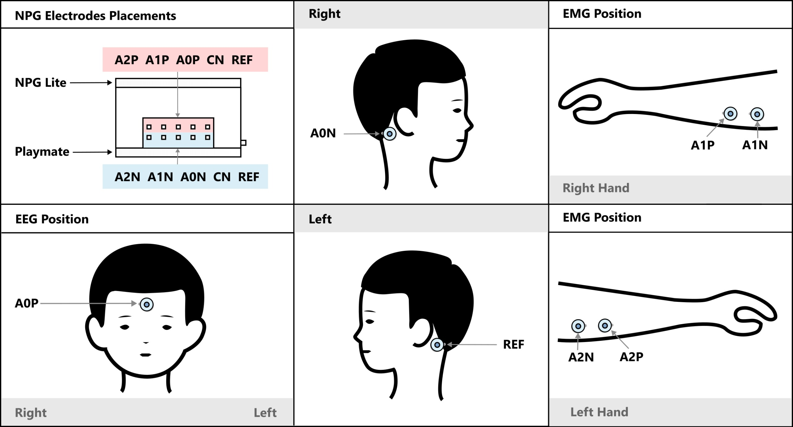
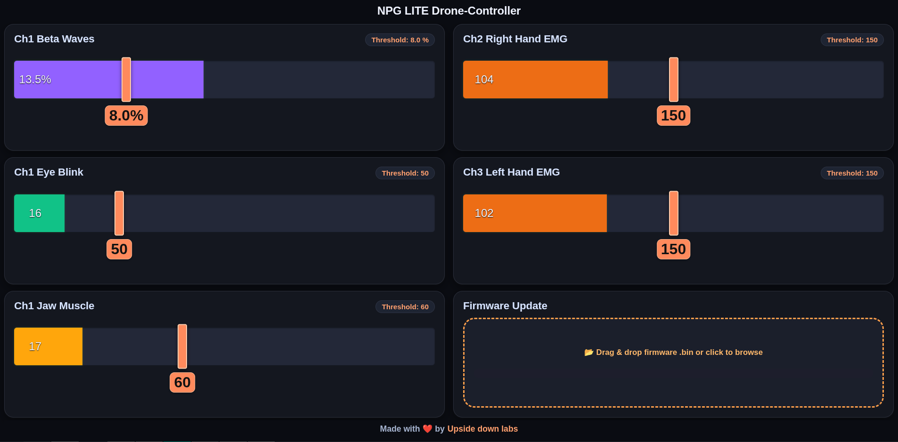

# EEG/EMG-Based Drone Control Firmware

This folder contains firmware for **brain–computer / muscle–computer interface** using the **NPG‑Lite** device. The system enables hands‑free control of a **UFO drone** using EEG (brain signals), EMG (muscle activity), eye blinks, and jaw clenches.

The firmware is designed for **research, demos, and educational neuroscience projects**.


## 1. Hardware Overview

### Recording Device (Signal Acquisition)

* **NPG‑Lite (ESP32-C6 based)**
* 3 analog input channels:

  * **CH1 (A0)** – EEG + blinks + jaw clench detection
  * **CH2 (A1)** – Left‑side EMG
  * **CH3 (A2)** – Right‑side EMG
* Sampling rate: **512 Hz**
* On‑board:

  * BOOT button (used for Emergency Stop / OTA mode trigger)
  * NeoPixel LEDs (×6)
  * Buzzer (pin 8)
  * Motor LED (pin 7)

### Controlled Device

* **UFO Drone**

  * Communication via **Wi‑Fi + UDP**
  * Uses UFO commands (`takeoff`, `land`, `up`, `down`, `rotate`, `forward`)


## 2. Electrode Placement

### EEG (Channel 1 – A0)

* Purpose:

  * Eye blink detection
  * Jaw clench detection
  * Beta‑band power estimation (for takeoff)

**Recommended placement:**

* Active electrode (AOP): **Center forehead**
* Reference (REF): **Behind the right ear**
* Ground (A0N): **Behind the left ear**

This placement provides strong blink artifacts and jaw EMG coupling.


### EMG – Left Hand (Channel 2 – A1)

* Place electrodes over **left forearm flexor muscles**
* Controls:

  * Vertical or rotational drone motion (mode‑dependent)

### EMG – Right Hand (Channel 3 – A2)

* Place electrodes over **right forearm flexor muscles**
* Controls:

  * Vertical or rotational drone motion (mode‑dependent)

**EMG placement tips:**

* Place electrodes parallel to muscle fibers



## 3. OTA Mode & Web Configuration

### Entering OTA Mode

Hold the **BOOT button during power-on** (within the first 1 second of boot). The device will start a Wi-Fi Access Point instead of connecting to the UFO.

| Wi-Fi SSID | Password |
|---|---|
| `NPG-Lite-UFO` | `12345678` |

Once connected, open a browser and navigate to:

```
http://192.168.4.1/
```
or (if mDNS is available):
```
http://npglite.local
```

### Web Dashboard

The web interface provides:


* **Live signal monitoring** – real-time bar graphs for Beta %, Eye Blink envelope, Jaw Muscle envelope, Left EMG, and Right EMG
* **Threshold sliders** – drag to adjust detection thresholds for each signal; changes auto-save after 800 ms
* **Firmware OTA update** – drag-and-drop a `.bin` file to flash new firmware over Wi-Fi; device reboots automatically after a successful update

**In OTA mode, all signal processing still runs** so the live displays reflect real sensor data.

**LED indicator in OTA mode:** All 6 NeoPixels pulse purple.


## 4. Persistent Threshold Storage 

All thresholds are saved to **ESP32 flash memory** (via `Preferences`) and automatically loaded on every boot. Thresholds survive power cycles and firmware-independent resets.

| Parameter | Default | Saved Key |
|---|---|---|
| Beta Threshold | 8.0 % | `betaTh` |
| Blink Threshold | 50.0 | `blinkTh` |
| Jaw ON Threshold | 60.0 | `jawOnTh` |
| Jaw OFF Threshold | 50.0 | `jawOffTh` |
| Left EMG Threshold | 150.0 | `emgLeftTh` |
| Right EMG Threshold | 150.0 | `emgRightTh` |

> **Note:** In the  Firmware, the Jaw OFF threshold is automatically set to `Jaw ON threshold − 10` when you adjust the Jaw ON slider.


## 5. Signal Processing Pipeline

### EEG Processing

* 50 Hz Notch Filter (power‑line noise removal)
* High‑pass filter
* Low‑pass EEG smoothing filter
* Envelope detection (moving average, 100 ms window)
* FFT (512‑point)
* Bandpower extraction:

  * Delta (0.5–4 Hz)
  * Theta (4–8 Hz)
  * Alpha (8–13 Hz)
  * **Beta (13–30 Hz)**
  * Gamma (30–45 Hz)

### EMG Processing

* 50 Hz Notch Filter
* High‑pass filter (70 Hz)
* Rectification
* Envelope detection (moving average)

### Jaw Clench Detection

* High‑pass filter (70 Hz)
* Envelope smoothing (100 ms window)
* Hysteresis thresholds:

  * ON: `60` (default, adjustable)
  * OFF: `50` (default, adjustable)


## 6. User Controls & Interactions

### 6.1 Drone Takeoff (EEG – Beta Power)

* When **Beta band power > threshold** (default: 8%):

  * Drone automatically sends `takeoff`
* Threshold is adjustable via the web UI ( Firmware)


### 6.2 Jaw Clench – Mode Switching

**Jaw Clench (single strong clench):**

* Toggles the control mode:

| Mode | LED Color | EMG Left (CH2) | EMG Right (CH3) |
|---|---|---|---|
| Vertical Mode | Red | `up` | `down` |
| Rotation Mode | Yellow | `forward` | `rotate right` |

* A 500 ms block is applied after each jaw clench to prevent accidental blink or EMG triggers during the clench event.
* A 500 ms debounce prevents rapid re-triggering.


### 6.3 Eye Blink Controls (EEG Envelope)

| Blink Pattern | Timing | Action |
|---|---|---|
| Single Blink | — | No action |
| Double Blink | ≤ 800 ms between blinks | Reserved / extendable |
| Triple Blink | ≤ 1000 ms for all three | Drone performs `land` |

* Per-blink debounce: **250 ms** (prevents noise re-triggers)
* Blink detection is **blocked for 500 ms** after a jaw clench event


### 6.4 EMG‑Based Motion Control

Separate thresholds for each hand (adjustable via web UI in  Firmware, fixed at 150 in Basic Firmware).

#### EMG Channel 2 – Left Hand (A1)

| Mode | Command Sent |
|---|---|
| Vertical Mode | `up` |
| Rotation Mode | `forward` |

#### EMG Channel 3 – Right Hand (A2)

| Mode | Command Sent |
|---|---|
| Vertical Mode | `down` |
| Rotation Mode | `rotate` |

* EMG controls are **blocked for 500 ms** after a jaw clench event.
* Command cooldown: **200 ms** between any two UDP commands.


## 7. Emergency Stop System (CRITICAL SAFETY FEATURE)

### Activation

* Press **BOOT button** on NPG‑Lite at any time during normal operation.

### Behavior When Active

* Immediately sends `emergency stop`
* Sends a second `emergency stop` command 5 seconds later
* All EEG/EMG controls disabled
* Police‑style LED flashing (Red × 2 flashes → Blue × 2 flashes, cycling)
* Buzzer alarm: 1 kHz beeping at 300 ms intervals

### Deactivation

* Press BOOT button again
* Normal operation resumes
* Blink detection state is reset


## 8. Wi-Fi & Connection Handling

### Basic Firmware

* Scans for networks starting with `"FLOW-UFO-` on startup
* Attempts connection up to 3 times, then continues without drone (orange LED)
* Checks connection every 5 seconds and attempts one reconnect on drop

###  Firmware

* Scans for `"FLOW-UFO-` networks and **retries indefinitely** until connected
* On connection loss, immediately re-enters the infinite scan-and-connect loop
* UDP is re-initialized automatically after reconnect
* The `command` SDK mode command is sent once after initial connection


## 9. LED & Buzzer Indicators


| Indicator | Meaning |
|---|---|
| Red LED (pixel 5) | Disconnected / error |
| Green LED (pixel 5) | UFO connected & UDP ready |
| Orange LED (pixel 5) | Waiting for drone (Basic Firmware) |
| Yellow LED (pixel 0) | Rotation Mode active |
| Red LED (pixel 0) | Vertical Mode active |
| Blue LED (pixel 2) | Triple blink detected |
| Purple pulse (all pixels) | OTA mode active |
| Red/Blue flash (all pixels) | Emergency stop active |
| Beeping buzzer (1 kHz) | Emergency stop active |


## 10. Startup Sequence

1. NeoPixel set to **Red**
2. Startup melody plays on buzzer, motor LED blinks in sync
3. Saved thresholds loaded from flash ( Firmware)
4. FFT initialized
5. **OTA check window ( Firmware):** Hold BOOT within first 1 second → enters OTA mode
6. Scan for and connect to UFO
7. UDP initialized, `command` sent to enter SDK mode
8. Web server started
9. Normal operation begins


## 11. Intended Use & Disclaimer

**This firmware is intended for research, education, and controlled demonstrations only.**

* Always test with propeller guards
* Maintain clear surroundings
* Never use near people or animals
* The emergency stop (BOOT button) should always be within reach during operation

> **Note:** If the drone is landed manually by hand, experiences a collision, or fails to take off correctly, 

> press the **reset button** on the NPG‑Lite to restart the device and clear any stuck state before resuming operation.

> Making neuroscience affordable and accessible for everyone 